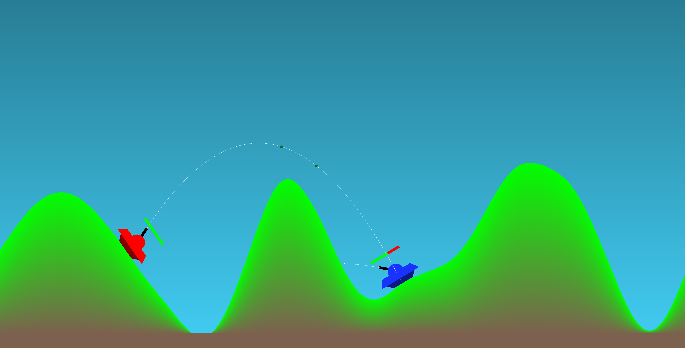
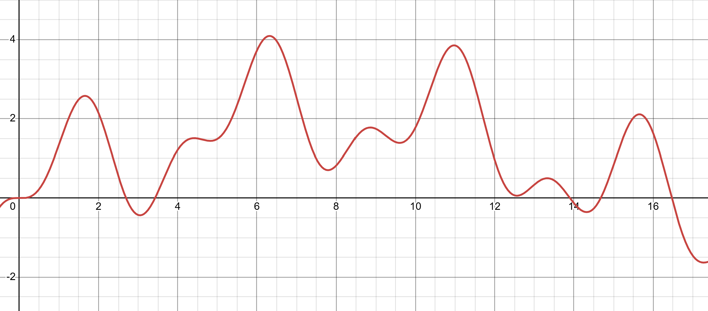
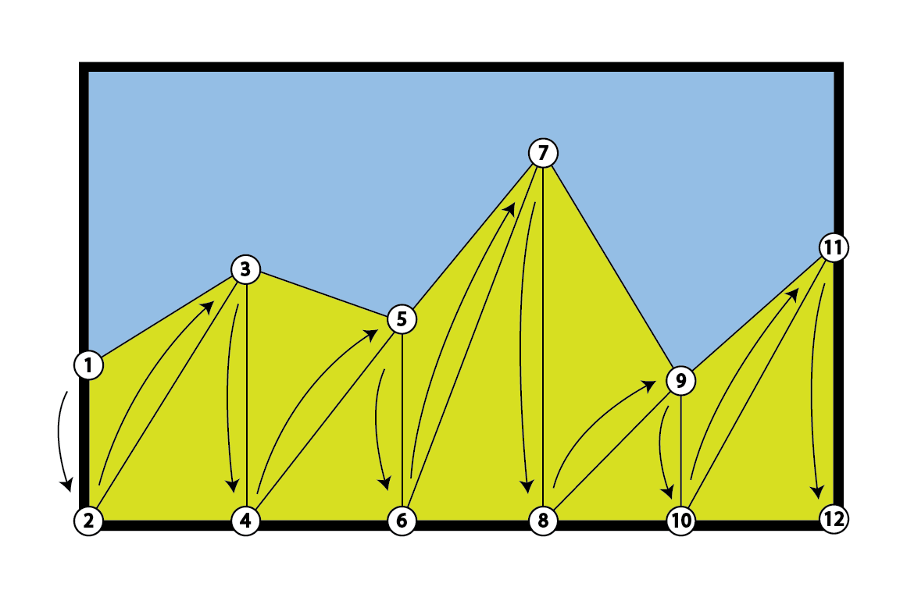
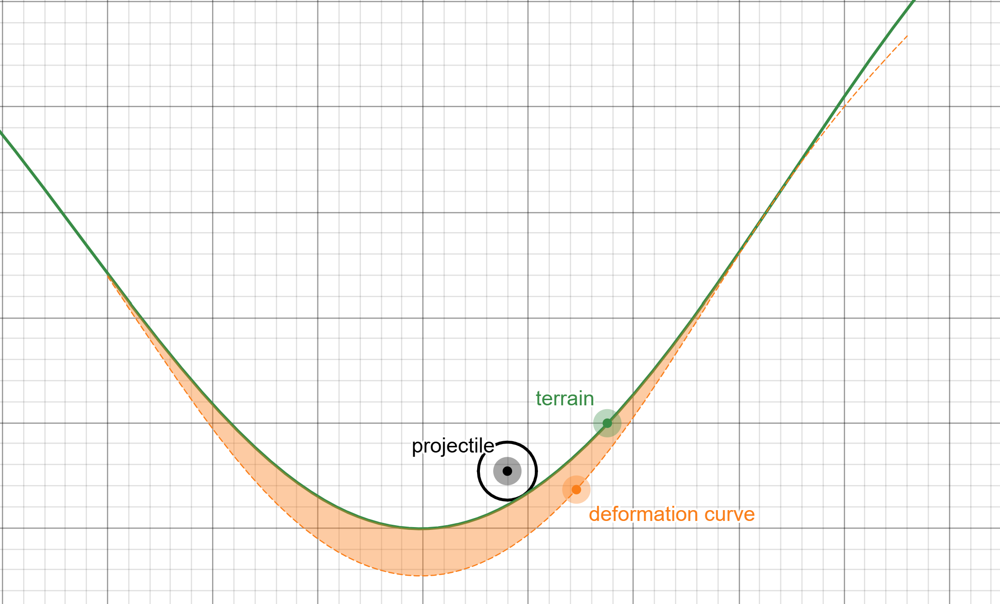
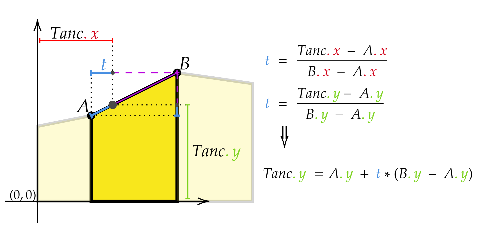

</img>

# **Tank Wars**
by _[Daniel Ghindea](https://www.github.com/Ghindea)_

**Tank Wars** is a simple RTS 2D shooter game, based on [GFX Framework](docs/README.md), developed in C++ using the OpenGL graphics library. The player's objective is to destroy the enemy tank while avoiding being destroyed themselves.

## Contents
- [Building project](#building-project)
- [How it works](#how-it-works)
- [Controls](#controls)
- [Bibliography](#bibliography)
- [License](#license)

## Building project

**Note:** Make sure that your environment follows the prerequisites listed in the [GFX Framework documentation](docs/README.md/#white_check_mark-prerequisites).

Open a terminal and go into the root folder of the project, which contains the top-level `CMakeLists.txt` file.
Do not run CMake directly from the top-level folder (meaning, do not do this: `cmake .`). Instead, make a separate directory, as follows:

1.  `mkdir build`
2.  `cd build`
3.  Generate the project:
    `cmake ..`
4.  Build the project:
    -   Windows, one of the following:
        -   `cmake --build .`
    -   Linux and macOS, one of the following:
        -   `cmake --build .`
        -   or just `make`

That's it! :tada:

**Note:** When running the CMake generation step on Windows (meaning, `cmake ..`), you may receive errors that include the phrase `Permission denied`. If you currently have the framework on the `C:` drive, for example on the Desktop, you might not have write permissions. Experimentally, we've found that this happens on single-drive devices (meaning, for example, computers with no disk partition other than `C:`). As an alternative, move the framework on the top-level (directly in `C:`) or create another drive partition (for example `D:`) and move it there.


## How it works

<details> <summary> Terrain generation </summary>

The terrain is generated by creating a height map made out of points placed on a sinusoid function. 

```
    f(x) = a1 * sin(f1 * x) + a2 * sin(f2 * x) + a3 * sin(f3 * x)    
```


Afterward, the terrain is rendered by creating a triangle strip topology like in the following diagram:



To generate the gradient effect on the terrain, the top vertexes are colored with a light green color, while the bottom ones are colored with a brown color. The gradient is calculated by interpolating the colors between the top and bottom vertexes.

The only step left is to deform the terrain when a projectile hits it. This is done by moving the vertexes in the vicinity of the projectile's impact point. To assure a smooth shape, instead of deforming the terrain by a circle shape, another sinusoid function is used.

```
    d(x) = (cos(abs(Xp - x) / r * PI) + 1 ) / 2 * maxDeformation # deformation curve
    n(x) = f(x) - d(x) # new height
```



</details>
<details> <summary> Player movement </summary>

To move the player there are 3 elements to be considered:
- the x coordinate which is updated by the player's input (`A`, `D`, `Left`, `Right`)
- the y coordinate which is calculated by the terrain height at the player's x coordinate:



- the angle of the tank which is calculated by the slope between points A and B:
```
    angle = atan2(By - Ay, Bx - Ax)
```
</details>
<details> <summary> Projectile shooting </summary>

Every time a player shoots a projectile, a new projectile object is created and introduced in a buffer of projectiles. By default, its limit is set to 5 projectiles,
but it can be increased by toggling the ammo limit.

The trajectory of the projectile always starts from the tip of the tank barrel. To update its position the following formulas are used:

```
    Position += Velocity * deltaTime
    Velocity.y -= gravity * deltaTime
```
This way the projectile will follow a parabolic trajectory. When the projectile hits the terrain, the terrain deformation is calculated and the projectile is destroyed.

To render the trajectory line a finite number of points are calculated by the same means and after that a line segment is rendered between each pair of consecutive points.

</details>
<details> <summary> Additional mechanics </summary>

- Camera shake when tank is hit:
    - The camera shake is achieved by moving the camera in a random direction for a short period of time.
- Animation when player dies:
    - The player's tank suffers a translation on a trajectory similar to that of a projectile and its angle and size are increased with every frame until it disappears from view.
</details>

## Controls
**Player 1:**
- Movement: `W`, `A`, `S`, `D`
- Fire: `Space`
- Change color: `1`

**Player 2:**
- Movement: `Up`, `Left`, `Down`, `Right`
- Fire: `Enter`
- Change color: `2`

**Gameplay:**
- Restart game: `R`
- Display trajectory: `L`
- Toggle ammo limit: `U`
- Sound on/off: `M`
- Night mode: `O`

## Bibliography

- [GFX Framework](docs/README.md)
- [OpenGL](https://www.opengl.org/)
- [triangle strip](https://en.wikipedia.org/wiki/Triangle_strip)

## License
TankWars project is published under [MIT Licence](https://en.wikipedia.org/wiki/MIT_License). For more information check [LICENSE.md](./LICENSE.md).

The GFX Framework is also published under the MIT License, for more information check [GFX Framework License](./docs/LICENSE.md) and [LEGAL.txt](./docs/LEGAL.txt).


   